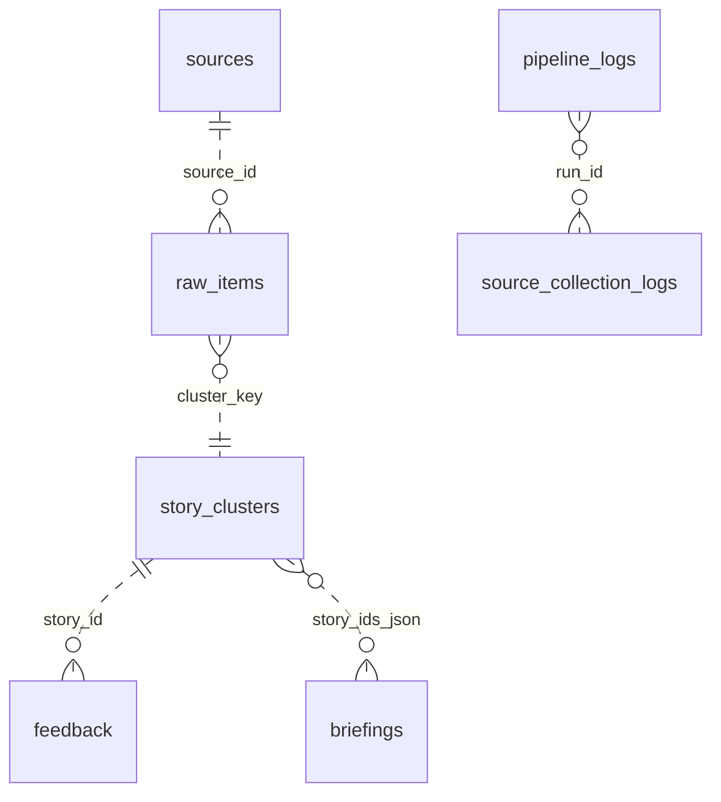

# NewsAgent Database Specification

Generated from the current SQLite database at `data/newsagent.db` and the database access layer in `newsagent/db.py`.

Last inspected: 2026-06-27

## 1. Purpose

NewsAgent stores collected source metadata, raw news items, clustered stories, generated briefings, user feedback, delivery attempts, LLM run telemetry, and pipeline execution logs in a local SQLite database.

The database is optimized for a local-first single-user workflow:

- Collect source items from RSS feeds, market feeds, GitHub, Hugging Face, CCTV, and similar collectors.
- Deduplicate raw items by stable content hash.
- Group raw items into story clusters by stable cluster key.
- Rank and select stories for daily briefings and ad hoc answers.
- Persist both deterministic and LLM-generated briefing editions.
- Record feedback and operational logs for future ranking and troubleshooting.

## 2. Database Engine

- Engine: SQLite
- Database file: `data/newsagent.db`
- Initialization code: `newsagent/db.py`
- Journal mode requested by schema: `WAL`
- Date/time storage: ISO 8601 text; application-generated timestamps are displayed in Tokyo local time (`+09:00`)
- JSON storage: text columns with `_json` suffix contain serialized JSON
- Foreign keys: no formal SQLite foreign key constraints are currently declared

## 3. Current Tables

| Table | Columns | Purpose |
| --- | ---: | --- |
| `sources` | 10 | Registered collection sources. |
| `raw_items` | 18 | Deduplicated collected source items. |
| `story_clusters` | 13 | Ranked story-level clusters derived from raw items. |
| `briefings` | 13 | Generated daily or ad hoc briefing documents. |
| `feedback` | 5 | User feedback against story clusters. |
| `llm_runs` | 6 | LLM invocation telemetry. |
| `delivery_logs` | 5 | Email or other delivery attempts. |
| `pipeline_logs` | 6 | Pipeline-level structured logs. |
| `source_collection_logs` | 12 | Per-source collection run results. |

## 4. Data Model Overview

Relationships shown above are application-level relationships. SQLite does not currently enforce them with foreign key constraints.

## 5. Naming and Storage Conventions

- Primary keys use `id`, except `sources.id`, which is a stable text identifier.
- Auto-increment tables use `INTEGER PRIMARY KEY AUTOINCREMENT`.
- Boolean values are stored as integers, usually `0` or `1`.
- JSON arrays and objects are stored as `TEXT`, for example `tags_json`, `metrics_json`, `story_ids_json`.
- Ranking uses `score` on `story_clusters`; query-time feedback adjustment may add derived fields such as `rank_score` in application memory.
- `content_hash` uniquely identifies a raw item and prevents duplicate ingestion.
- `cluster_key` groups raw items that represent the same story or market symbol.

## 6. Table Specifications

### 6.1 `sources`

Stores the configured collection sources loaded from `config/sources.json`.

| Column | Type | Required | Key/default | Description |
| --- | --- | --- | --- | --- |
| `id` | TEXT | Yes | Primary key | Stable source identifier used by collectors and raw items. |
| `name` | TEXT | Yes | | Human-readable source name. |
| `kind` | TEXT | Yes | | Collector type, such as `rss`, `github_search`, or `yahoo_quotes`. |
| `category` | TEXT | Yes | | Primary content category. |
| `subcategory` | TEXT | No | | Optional finer-grained source type. |
| `region` | TEXT | No | | Region label such as `global`, `us`, `china`, `japan`, or `europe`. |
| `tier` | INTEGER | No | | Source reliability or priority tier. Lower tiers are more important in ranking. |
| `priority` | TEXT | No | | Collection/ranking priority, currently `P0` or `P1`. |
| `enabled` | INTEGER | No | | Boolean-like flag indicating whether the source is active. |
| `updated_at` | TEXT | Yes | | Last time this source row was upserted. |

Indexes:

- Primary key auto-index on `id`.

Current observed values:

- Categories: `world_news`, `medicine`, `ai`, `ai_engineering`, `ai_hardware`, `market`, `policy`
- Kinds: `rss`, `cctv_xinwen_lianbo`, `github_search`, `huggingface_models`, `yahoo_quotes`
- Priorities: `P0`, `P1`
- Enabled flags in the database snapshot: 34 enabled sources, 9 disabled sources
- Current `config/sources.json` contains 42 sources, 33 enabled. The extra database row is historical; source upserts update configured sources but do not delete old source rows.

### 6.2 `raw_items`

Stores individual collected items after normalization and deduplication.

| Column | Type | Required | Key/default | Description |
| --- | --- | --- | --- | --- |
| `id` | INTEGER | Yes | Primary key | Surrogate raw item identifier. |
| `content_hash` | TEXT | Yes | Unique | Stable hash used for deduplication. |
| `cluster_key` | TEXT | Yes | Indexed | Stable key used to attach the item to a story cluster. |
| `source_id` | TEXT | Yes | | Application-level reference to `sources.id`. |
| `source_name` | TEXT | Yes | | Source display name at collection time. |
| `category` | TEXT | Yes | Indexed | Normalized category used for retrieval and ranking. |
| `subcategory` | TEXT | No | | Optional subcategory copied from the source/item. |
| `region` | TEXT | No | | Region copied from the source/item. |
| `title` | TEXT | Yes | | Item title. |
| `url` | TEXT | Yes | | Canonical source URL or source-specific stable URL. |
| `summary` | TEXT | No | | Source summary or normalized excerpt. |
| `published_at` | TEXT | No | | Source publication timestamp when available. |
| `retrieved_at` | TEXT | Yes | Indexed | Collection timestamp. |
| `language` | TEXT | No | | Source language when known. |
| `metrics_json` | TEXT | No | | JSON object for source-specific metrics. |
| `tags_json` | TEXT | No | | JSON array of normalized tags. |
| `tier` | INTEGER | No | | Item/source tier used by ranking. |
| `priority` | TEXT | No | | Item/source priority used by ranking. |

Indexes:

- Unique auto-index on `content_hash`
- `idx_raw_items_category` on `category`
- `idx_raw_items_retrieved` on `retrieved_at`
- `idx_raw_items_cluster` on `cluster_key`

Application behavior:

- Inserts use `INSERT OR IGNORE`, so duplicate `content_hash` values are skipped.
- Market items include `symbol`, `quote_time`, and `market_state` in `metrics_json` when building `content_hash`.
- Market clusters are grouped by category, source, and symbol. Other clusters are grouped by category, region, and normalized title.

Current observed categories:

- `world_news`, `market`, `medicine`, `ai`, `ai_engineering`, `ai_hardware`

### 6.3 `story_clusters`

Stores story-level clusters derived from raw items.

| Column | Type | Required | Key/default | Description |
| --- | --- | --- | --- | --- |
| `id` | INTEGER | Yes | Primary key | Surrogate story identifier. |
| `cluster_key` | TEXT | Yes | Unique | Stable key shared with related `raw_items`. |
| `title` | TEXT | Yes | | Representative story title. |
| `summary` | TEXT | No | | Representative story summary. |
| `category` | TEXT | Yes | Indexed | Story category. |
| `subcategory` | TEXT | No | | Story subcategory. |
| `region` | TEXT | No | | Story region, defaulted to `global` in application code when missing. |
| `score` | REAL | Yes | Default `0` | Base rank score from `score_raw_item()`. |
| `source_urls_json` | TEXT | Yes | | JSON array of source URLs included in the cluster. |
| `item_ids_json` | TEXT | Yes | | JSON array of related `raw_items.id` values. |
| `tags_json` | TEXT | Yes | | JSON array of tags. |
| `created_at` | TEXT | Yes | | Cluster creation timestamp. |
| `updated_at` | TEXT | Yes | | Last cluster update timestamp. |

Indexes:

- Unique auto-index on `cluster_key`
- `idx_story_score` on `score DESC`
- `idx_story_category` on `category`

Application behavior:

- Cluster upsert is keyed by `cluster_key`.
- On conflict, title, summary, URLs, item IDs, tags, score, and `updated_at` are updated.
- Score is retained as `max(existing_score, incoming_score)`.
- Briefing selection pulls stories from categories including `market`, `world_news`, `medicine`, `policy`, `ai`, `ai_engineering`, and `ai_hardware`.

Current observed categories:

- `world_news`, `medicine`, `ai`, `ai_engineering`, `ai_hardware`, `market`

### 6.4 `briefings`

Stores generated briefing documents.

| Column | Type | Required | Key/default | Description |
| --- | --- | --- | --- | --- |
| `id` | INTEGER | Yes | Primary key | Surrogate briefing identifier. |
| `language` | TEXT | Yes | | Output language, such as `original`, `zh`, `en`, or `ja`. |
| `title` | TEXT | Yes | | Briefing title. |
| `body` | TEXT | Yes | | Final briefing body shown to users or delivered by email. |
| `story_ids_json` | TEXT | Yes | | JSON array of selected `story_clusters.id` values. |
| `created_at` | TEXT | Yes | | Creation timestamp. |
| `canonical_body` | TEXT | No | | Canonical source-language body before optional translation. |
| `translation_status` | TEXT | Yes | Default `legacy` | Translation outcome. |
| `translation_model` | TEXT | No | | Model used for translation, when applicable. |
| `briefing_group` | TEXT | No | | Shared UUID for deterministic and LLM variants from the same run. |
| `generation_mode` | TEXT | Yes | Default `legacy` | Generation path, such as `rules` or `llm`. |
| `generation_status` | TEXT | Yes | Default `legacy` | Generation outcome, such as `deterministic` or `generated`. |
| `generation_model` | TEXT | No | | Model used for briefing generation, when applicable. |

Current observed values:

- Languages: `zh` (70), `original` (23), `ja` (15), `en` (1)
- Generation modes/statuses: `legacy/legacy` (43), `rules/deterministic` (33), `llm/generated` (33)
- Translation statuses: `legacy` (41), `translated` (39), `not_requested` (23), `fallback_original` (6)

Application behavior:

- Daily briefing creation saves two variants for the same story selection: `rules` and `llm`.
- Both variants share the same `briefing_group`.
- `body` is the final output language body. `canonical_body` preserves the canonical body when translation is requested.

### 6.5 `feedback`

Stores user feedback for story ranking.

| Column | Type | Required | Key/default | Description |
| --- | --- | --- | --- | --- |
| `id` | INTEGER | Yes | Primary key | Surrogate feedback identifier. |
| `story_id` | INTEGER | Yes | | Application-level reference to `story_clusters.id`. |
| `feedback` | TEXT | Yes | | Feedback value. |
| `note` | TEXT | No | | Optional user note. |
| `created_at` | TEXT | Yes | | Feedback timestamp. |

Allowed feedback values in application code:

- `important`
- `track_more`
- `show_less`
- `irrelevant`

Application behavior:

- Direct feedback strongly adjusts the same story during ranking.
- Category and tag overlap produce smaller boosts or penalties for similar future stories.

### 6.6 `llm_runs`

Stores telemetry for LLM calls.

| Column | Type | Required | Key/default | Description |
| --- | --- | --- | --- | --- |
| `id` | INTEGER | Yes | Primary key | Surrogate run identifier. |
| `provider` | TEXT | Yes | | LLM provider name. |
| `model` | TEXT | Yes | | Model name. |
| `ok` | INTEGER | Yes | | Boolean-like success flag. |
| `error` | TEXT | No | | Error message, truncated by application code to 500 characters. |
| `created_at` | TEXT | Yes | | Run timestamp. |

Current observed values:

- Provider/model: `ollama` / `qwen3:8b`
- `ok`: 111 successful runs and 7 failed runs

### 6.7 `delivery_logs`

Stores outbound delivery attempts, currently email.

| Column | Type | Required | Key/default | Description |
| --- | --- | --- | --- | --- |
| `id` | INTEGER | Yes | Primary key | Surrogate delivery log identifier. |
| `channel` | TEXT | Yes | | Delivery channel, for example `email`. |
| `status` | TEXT | Yes | | Delivery status, for example `success` or `failed`. |
| `message` | TEXT | No | | Structured JSON text or plain text message, truncated to 1,000 characters. |
| `created_at` | TEXT | Yes | | Log timestamp. |

Application behavior:

- Email delivery logs include fields such as `briefing_id`, `subject`, `ok`, `recipient_count`, and `error` inside `message`.

### 6.8 `pipeline_logs`

Stores pipeline-level structured log events.

| Column | Type | Required | Key/default | Description |
| --- | --- | --- | --- | --- |
| `id` | INTEGER | Yes | Primary key | Surrogate pipeline log identifier. |
| `run_id` | TEXT | Yes | Indexed | UUID-like identifier shared across one pipeline run. |
| `level` | TEXT | Yes | Indexed with `event` | Log level, such as `INFO` or `WARNING`. |
| `event` | TEXT | Yes | Indexed with `level` | Event name. |
| `message_json` | TEXT | Yes | | JSON object with structured event details. |
| `created_at` | TEXT | Yes | Indexed | Log timestamp. |

Indexes:

- `idx_pipeline_logs_run_id` on `run_id`
- `idx_pipeline_logs_created` on `created_at`
- `idx_pipeline_logs_level_event` on `level, event`

Current observed events:

- `run_started`
- `collect_finished`
- `briefing_created`
- `run_finished`
- `source_failed`
- `briefing_below_min_stories`
- `email_finished`

Current observed event counts:

- `source_failed`: 29
- `run_started`: 5
- `collect_finished`: 4
- `briefing_created`: 4
- `run_finished`: 4
- `briefing_below_min_stories`: 2
- `email_finished`: 2

### 6.9 `source_collection_logs`

Stores per-source collection statistics for each collection or daily run.

| Column | Type | Required | Key/default | Description |
| --- | --- | --- | --- | --- |
| `id` | INTEGER | Yes | Primary key | Surrogate source collection log identifier. |
| `run_id` | TEXT | Yes | Indexed | Identifier shared across a pipeline run. |
| `source_id` | TEXT | Yes | Indexed with `created_at` | Application-level reference to `sources.id`. |
| `source_name` | TEXT | Yes | | Source display name at run time. |
| `status` | TEXT | Yes | Indexed with `created_at` | Collection status, currently `success` or `failed`. |
| `fetched` | INTEGER | Yes | | Number of items fetched from the source. |
| `inserted` | INTEGER | Yes | | Number of new `raw_items` inserted. |
| `existing` | INTEGER | Yes | | Number of fetched items skipped as duplicates. |
| `error` | TEXT | No | | Error message, truncated by application code to 500 characters. |
| `started_at` | TEXT | Yes | | Per-source collection start time. |
| `finished_at` | TEXT | Yes | | Per-source collection finish time. |
| `created_at` | TEXT | Yes | | Log row creation timestamp. |

Indexes:

- `idx_source_collection_run_id` on `run_id`
- `idx_source_collection_source` on `source_id, created_at`
- `idx_source_collection_status` on `status, created_at`

## 7. Index Summary

| Index | Table | Columns | Purpose |
| --- | --- | --- | --- |
| `idx_raw_items_category` | `raw_items` | `category` | Category filtering. |
| `idx_raw_items_retrieved` | `raw_items` | `retrieved_at` | Freshness and ingestion-order queries. |
| `idx_raw_items_cluster` | `raw_items` | `cluster_key` | Cluster lookup and refresh. |
| `idx_story_score` | `story_clusters` | `score DESC` | Ranking by base score. |
| `idx_story_category` | `story_clusters` | `category` | Category-specific story selection. |
| `idx_pipeline_logs_run_id` | `pipeline_logs` | `run_id` | Run-level log retrieval. |
| `idx_pipeline_logs_created` | `pipeline_logs` | `created_at` | Time-based log retrieval. |
| `idx_pipeline_logs_level_event` | `pipeline_logs` | `level`, `event` | Operational filtering. |
| `idx_source_collection_run_id` | `source_collection_logs` | `run_id` | Run-level source summary. |
| `idx_source_collection_source` | `source_collection_logs` | `source_id`, `created_at` | Source history. |
| `idx_source_collection_status` | `source_collection_logs` | `status`, `created_at` | Failure and success monitoring. |

SQLite also creates automatic indexes for primary keys and unique constraints, including `sources.id`, `raw_items.content_hash`, and `story_clusters.cluster_key`.

## 8. Application-Level Relationships

| From | To | Join key | Notes |
| --- | --- | --- | --- |
| `raw_items.source_id` | `sources.id` | Text source id | Not enforced by SQLite. |
| `raw_items.cluster_key` | `story_clusters.cluster_key` | Cluster key | Used to detect unclustered or refreshed raw items. |
| `story_clusters.item_ids_json` | `raw_items.id` | JSON array | Application code parses this to attach latest raw metadata. |
| `briefings.story_ids_json` | `story_clusters.id` | JSON array | Captures selected stories for a briefing. |
| `feedback.story_id` | `story_clusters.id` | Integer id | Used by ranking feedback adjustment. |
| `pipeline_logs.run_id` | `source_collection_logs.run_id` | Text run id | Correlates run-level and per-source logs. |

## 9. Ranking and Briefing Notes

Base story scores are derived from raw item data in `newsagent/ranking.py`.

Factors include:

- Priority weight: `P0`, `P1`, `P2`
- Category weight: market, policy, medicine, AI, AI engineering, AI hardware, world news
- Source tier
- Recency from `published_at` or `retrieved_at`
- Feed position from `metrics_json.feed_rank`
- High-impact keywords in title and summary
- URL and summary presence

User feedback is applied at query time, not written back into `story_clusters.score`.

## 10. Migration Notes

The schema in `newsagent/db.py` includes `CREATE TABLE IF NOT EXISTS` statements plus additive column migrations for the `briefings` table. Current `briefings` column order reflects historical creation plus later `ALTER TABLE ADD COLUMN` migrations.

When adding schema changes:

- Prefer additive migrations for local data safety.
- Keep JSON text columns backwards compatible.
- Add indexes for new query patterns that filter by category, run id, timestamp, status, or ranking score.
- If formal foreign keys are introduced later, existing rows should be validated first because current relationships are not enforced by SQLite.

## 11. Current Data Profile

Current source mix:

- `world_news`: 15 sources
- `medicine`: 10 sources
- `ai`: 8 sources
- `ai_engineering`: 2 sources
- `ai_hardware`: 1 source
- `market`: 6 sources
- `policy`: 1 source
- Enabled sources: 34
- Disabled sources: 9

Current `config/sources.json` mix may differ from the database if sources were removed or disabled after earlier runs. As of this inspection, config contains 42 sources and 33 enabled sources.

Current story mix:

- `world_news`: 1,082 stories
- `medicine`: 284 stories
- `ai`: 253 stories
- `ai_engineering`: 150 stories
- `ai_hardware`: 50 stories
- `market`: 68 stories

Current operational profile:

- LLM provider/model observed: `ollama` / `qwen3:8b`
- LLM run outcomes observed: 111 successful, 7 failed
- Source collection statuses observed: 153 `success`, 30 `failed`
- Pipeline log levels observed: `INFO` (19), `WARNING` (31)
