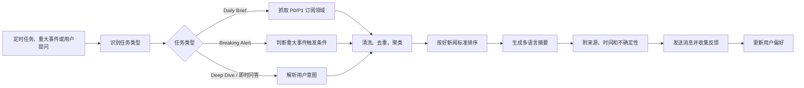

# 每日市场与行业情报 Agent PRD

## 1. 产品概述

每日市场与行业情报 Agent 是一个面向个人决策的情报简报系统。它每天自动汇总市场、政策、AI、医疗和重点数据，并支持用户随时询问最新消息。

产品的核心价值不是“收集更多新闻”，而是帮助用户判断：

- 今天有哪些变化值得注意。
- 这些变化为什么重要。
- 哪些事件需要继续追踪。
- 哪些信息可能影响宏观风险、技术趋势、医疗行业和政策环境。

## 2. 用户决策目的

本产品服务于四类核心决策：

### 2.1 判断宏观市场风险

帮助用户快速了解能源、汇率、金属、股价板块和重大政策对市场风险的影响。

重点问题：

- 油价、汇率、金属价格是否出现异常波动。
- 波动背后的原因是否来自战争、制裁、央行、库存、需求或政策。
- 是否有可能影响科技、医疗或跨境业务的宏观事件。

### 2.2 跟踪 AI 最新动态

帮助用户跟踪 AI research、Data Science、工程落地、开源项目、科技产业和 AI 硬件基础设施动态。

重点范围：

- 重要模型、论文、框架和工具。
- Hugging Face 上的热门模型和数据集。
- GitHub 上增长较快、工程质量较好的项目。
- OpenAI、Google、Meta、Anthropic 等官方技术动态。
- 对实际产品开发有参考价值的 AI 工程实践。
- AI 芯片、GPU、服务器、数据中心、半导体制造、先进封装、存储和网络基础设施动态。
- NVIDIA、AMD、Intel、TSMC、Samsung Semiconductor、ASML、Micron、SK hynix 等关键厂商动态。
- 数据中心、电力、冷却、云基础设施和 AI 资本开支相关变化。

### 2.3 跟踪医疗最新动态

帮助用户跟踪医学期刊、制药、医疗器械、数字医疗和监管变化。

重点范围：

- Nature、The Lancet、JAMA、Nature Digital Medicine 等期刊动态。
- 制药和医疗器械行业新闻。
- 临床研究、监管审批、指南变化。
- 数字医疗、AI 医疗、真实世界数据相关动态。

### 2.4 发现政策变化

帮助用户及时发现中国、日本、美国、欧盟的政策变化，尤其是可能影响医疗、AI、产业、贸易和市场的数据。

重点范围：

- 政府、监管机构、央行和官方部门发布的信息。
- 医疗、AI、产业政策、贸易政策和金融监管。
- 对企业、行业、市场价格和跨境业务可能产生影响的变化。

## 3. 目标用户

- 需要跟踪宏观市场风险的人。
- 关注 AI 技术和工程项目的人。
- 关注医疗、制药、医疗器械和数字医疗的人。
- 关注中日美欧政策变化的人。
- 需要中文、日文、英文信息切换的人。

## 4. 信息优先级

### P0：每日必须覆盖

P0 是每日简报的核心内容，即使其他模块失败，也应尽量生成。

- 油价。
- 汇率：美元、日元、英镑、人民币相关汇率。
- 政策：中国、日本、美国、欧盟。
- 医学期刊和医疗重点动态。
- AI 最新动态，包括 Hugging Face、GitHub、论文、官方技术博客和关键 AI 基础设施新闻。

### P1：重要但可后置

P1 适合在数据稳定后加入每日简报，也可在用户询问时返回。

- 金属：黄金、白银、铜、铝、镍、锂等。
- 财报时间。
- 股价板块：科技、医疗、制药、医疗器械。
- AI 硬件供应链和数据中心基础设施的深度跟踪。

### P2：复杂数据类

P2 需要更强的数据清洗和解释能力，建议后续迭代。

- 城市数据：人口、就业、收入、迁移等。
- 产业数据：产量、销量、库存、投资、进出口等。
- 长周期统计数据和多来源对比分析。

## 5. 好新闻标准

Agent 不应把所有抓到的内容都推送给用户。进入简报的新闻应尽量满足以下标准：

- 来自官方来源、一级来源、权威媒体或可信数据库。
- 可能影响价格、政策、行业趋势或用户关注领域。
- 与宏观市场、AI、医疗或政策强相关。
- 不是重复报道；同一事件应合并成一个 story。
- 有明确发布时间、来源链接和可验证事实。
- 包含可行动信息，例如需要继续追踪、影响某类资产、影响某个行业或提示潜在风险。
- 对 AI 硬件和基础设施新闻，应优先选择公司官方发布、财报、监管文件、产业协会、供应链一级信息或高质量技术媒体。

## 6. 可靠来源范围

AI、科技和硬件基础设施建议优先覆盖以下来源类型：

- AI 官方来源：OpenAI、Anthropic、Google DeepMind、Meta AI、Microsoft AI、NVIDIA AI、AWS、Google Cloud、Azure。
- AI 研究与工程平台：arXiv、Papers with Code、Hugging Face、GitHub、PyTorch、TensorFlow、JAX。
- AI 工程项目：GitHub Trending、GitHub Search/API、Hugging Face Models、Datasets、Spaces。
- 半导体和 AI 硬件厂商：NVIDIA、AMD、Intel、Qualcomm、Broadcom、TSMC、Samsung Semiconductor、SK hynix、Micron。
- 半导体设备和制造：ASML、Applied Materials、Lam Research、Tokyo Electron、KLA、SEMI。
- 数据中心和基础设施：云厂商官方博客、数据中心公司公告、电力和冷却相关官方资料。
- 科技权威媒体：MIT Technology Review、IEEE Spectrum、The Information、The Register、Ars Technica、Wired、TechCrunch。

优先顺序仍然是官方和一级来源；科技媒体用于补充背景和行业解释，不应单独作为关键事实依据。

## 7. 核心功能

当前实现状态：Daily Brief、即时问答、多语言输出、反馈、Markdown 文件输出、SMTP 邮件和 Windows 定时任务脚本已经进入本地 MVP。Breaking Alert 和 Deep Dive 仍是后续规划，不应按已上线能力验收。

### 7.1 Daily Brief：每日简报

每天在用户设定时间推送一份结构化情报。

建议结构：

- 今日重点：最多 3 到 5 条。
- 宏观市场：油价、汇率，后续加入金属。
- 政策变化：中国、日本、美国、欧盟。
- AI 动态：论文、模型、工具、Hugging Face、GitHub、AI 硬件和基础设施。
- 医疗动态：期刊、制药、医疗器械、监管。
- 财报和股价板块：MVP 后加入。
- 需要继续追踪的主题。
- 来源链接。

### 7.2 Breaking Alert：重大事件提醒（规划）

当出现重大事件时，不等待每日简报，立即发送提醒。

触发示例：

- 油价、汇率或金属价格出现大幅波动。
- 中国、日本、美国、欧盟发布重大政策。
- FDA、EMA、PMDA 等监管机构发布重大医疗相关决定。
- AI 领域出现重要模型、框架、漏洞、监管或基础设施事件。
- AI 芯片、先进封装、关键产能、数据中心、电力或云基础设施出现重大供需变化。
- 用户明确追踪的公司、期刊或项目出现重大更新。

### 7.3 Deep Dive：追问后的深度分析（规划）

用户对某条新闻追问时，Agent 提供更完整的背景和影响分析。

示例问题：

- 这次日元波动的主要原因是什么？
- 这个 GitHub 项目为什么值得关注？
- NVIDIA 或 TSMC 的最新公告对 AI 基础设施有什么影响？
- 这篇 JAMA 论文对数字医疗有什么意义？
- 这项欧盟 AI 政策可能影响哪些公司？

Deep Dive 应包含：

- 事实摘要。
- 背景。
- 影响分析。
- 不确定性。
- 后续需要追踪的指标或事件。
- 来源链接。

### 7.4 即时问答

用户可以随时询问最新消息。

示例：

- 今天油价为什么涨？
- 日本最近医疗器械政策有什么变化？
- 用英文总结今天 AI 工程项目新闻。
- 给我最新 Nature Digital Medicine 动态。
- Hugging Face 最近有哪些值得看的模型？
- GitHub 上最近有哪些 AI 项目增长很快？
- 最近 AI 芯片和数据中心基础设施有什么重要新闻？

### 7.5 多语言切换

支持三种输出语言：

- 中文。
- 日文。
- 英文。

用户可以设置默认语言，也可以在单次问题中指定语言。

### 7.6 用户反馈机制

每条推送消息应支持简单反馈，用于优化后续排序和过滤。

基础反馈：

- 重要。
- 不相关。
- 以后少推类似内容。
- 深入追踪这个话题。

反馈用途：

- 调整主题权重。
- 降低低价值来源权重。
- 增加用户关注关键词。
- 自动生成追踪列表。
- 改善每日简报排序。

### 7.7 历史记录与检索

系统应保存每日简报、用户反馈、来源记录和关键 story，方便之后搜索、追踪趋势和改进个性化排序。

MVP 阶段不需要保存所有网页全文，但需要保存：

- 标题。
- 来源。
- URL。
- 发布时间。
- 摘要。
- 分类和标签。
- 用户反馈。
- 进入过简报的 story。

## 8. 产品流程图

## 9. MVP 范围

当前本地 MVP 已经覆盖：

- Daily Brief 每日定时推送。
- 即时问答：用户询问时返回最新 news。
- 中文默认输出，支持英文和日文输出。
- P0 覆盖：油价、汇率、政策、医学期刊、AI 动态。
- AI 动态包含 Hugging Face、GitHub、官方 AI 新闻和关键 AI 硬件基础设施新闻。
- 每条重要消息附来源链接。
- 支持一个推送渠道：Email。
- 支持基础反馈：重要、不相关、少推、深入追踪。
- 保存每日简报和进入简报的 story，支持后续检索。
- 同一轮简报同时保存 rules 与 llm 两版。
- 记录 pipeline、source collection、LLM run 和 email delivery 日志。

暂不做：

- 自动投资建议。
- 自动交易。
- 多用户权限系统。
- 复杂图表。
- 长周期城市和产业数据库分析。
- Breaking Alert 自动监控。
- 专用 Deep Dive 工作流。
- Telegram、LINE、Slack 或企业微信投递。

## 10. 主要产品难点

- 覆盖范围很广，MVP 必须优先做好 P0。
- 用户真正需要的是高信噪比，而不是更多新闻。
- 市场数据、政策、医疗内容对准确性要求高，不能无来源推断。
- AI 和 GitHub 热点很多，需要识别工程质量，而不是只看热度。
- AI 硬件和基础设施新闻容易被市场情绪放大，需要区分官方事实、供应链传闻和媒体解读。
- 多语言输出需要术语一致，不能简单直译。
- 反馈闭环需要逐步积累用户偏好，否则个性化效果有限。

## 11. 成功指标

- 每日推送成功率大于 99%。
- P0 内容每日覆盖率大于 95%。
- 重要消息来源链接覆盖率大于 95%。
- 用户标记“不相关”的比例逐周下降。
- 用户每周主动提问不少于 3 次。
- 每日简报生成时间小于 5 分钟。
- Deep Dive 回答中可追溯来源覆盖率大于 95%。

## 12. 待确认问题

- 第一版推送渠道选择什么：Email、Telegram、LINE、Slack、企业微信？
- 默认推送时间是北京时间还是东京时间？
- 默认语言是中文、日文还是英文？
- 市场数据是否需要具体价格、涨跌幅和图表？
- 股价板块用指数、ETF，还是指定公司列表？
- 本地 LLM 使用哪种部署方式：Ollama、LM Studio、vLLM，还是 llama.cpp？
- 是否允许使用云端 LLM 作为备用方案？
- 是否需要保存每日历史简报，方便之后搜索？
- 历史数据默认保存多久：90 天、1 年、3 年，还是长期保存摘要和删除原始抓取？
