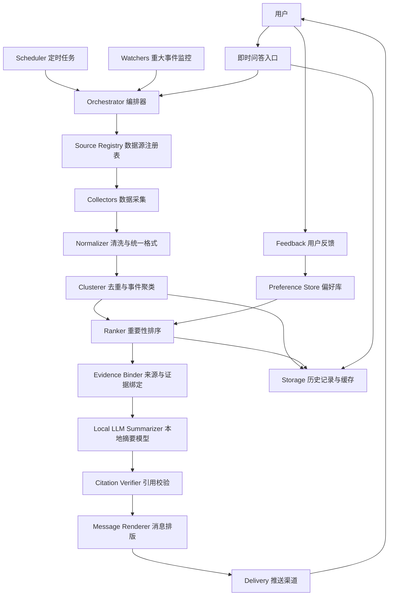
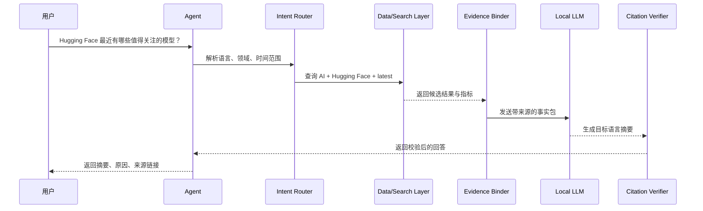

# 每日市场与行业情报 Agent Specification

## 1. 技术目标

构建一个本地优先的市场与行业情报 Agent。系统需要支持每日定时简报、重大事件提醒、即时问答和追问深度分析。

技术设计目标：

- 优先使用本地 LLM 部署，降低成本并增强数据控制。
- 所有关键结论尽量绑定来源、时间和证据。
- 对新闻进行去重、聚类和重要性排序。
- 支持中文、日文、英文输出。
- 支持用户反馈，并将反馈用于后续排序。
- 在数据源、模型或推送失败时可降级运行。

## 2. 推荐架构



## 3. 本地 LLM 部署策略

### 3.1 默认原则

系统默认优先使用本地 LLM。外部云端模型只作为可选 fallback，不作为 MVP 必需项。

本地 LLM 适合处理：

- 新闻摘要。
- 多语言改写。
- 用户问题解析。
- 信息分类。
- 重要性解释。
- Deep Dive 草稿生成。

本地 LLM 不应单独决定事实。事实必须来自数据源、搜索结果、市场 API 或官方页面。

### 3.2 推荐部署选项

MVP 推荐优先级：

1. Ollama：安装简单，适合本地开发和快速验证。
2. LM Studio：适合图形化管理模型。
3. llama.cpp：适合轻量、可控的本地推理。
4. vLLM：适合后续服务器部署和并发推理。

### 3.3 模型建议

可先选择支持中英日能力较好的开源模型：

- Qwen 系列。
- Llama 系列。
- Gemma 系列。
- Mistral 系列。

选型标准：

- 中文、英文、日文摘要质量。
- 长上下文能力。
- 本地硬件可运行。
- JSON 输出稳定性。
- 对金融、政策、医疗术语的基本理解能力。

### 3.4 本地 LLM 风险

- 对最新事实不了解，必须依赖检索和数据源。
- 多语言术语可能不稳定，需要术语表。
- 小模型容易遗漏细节或过度概括。
- 长新闻列表可能超过上下文，需要先聚类和截断。
- 医疗、金融和政策内容必须避免无来源推断。

### 3.5 云端 fallback

如果用户允许，可配置云端 LLM 作为备用：

- 本地模型不可用时 fallback。
- Deep Dive 质量不足时 fallback。
- 多语言翻译质量不足时 fallback。

fallback 必须显式配置，不能默认上传敏感数据。

## 4. 模块说明

### 4.1 Scheduler

负责每日定时触发 Daily Brief。

配置示例：

```json
{
  "timezone": "Asia/Tokyo",
  "daily_push_time": "08:00",
  "retry_policy": {
    "max_retries": 3,
    "interval_minutes": 10
  }
}
```

### 4.2 Watchers

负责监控重大事件并触发 Breaking Alert。

触发条件示例：

- 油价或汇率超过设定涨跌幅。
- 官方机构发布重大政策。
- 医学监管机构发布重大审批或安全信息。
- GitHub 项目 star、fork、release 或 issue 活跃度异常。
- Hugging Face 模型或数据集出现快速增长。

### 4.3 Source Registry

所有数据源都必须注册，便于管理可靠性、频率、限流和授权。

示例：

```yaml
sources:
  - id: fda_news
    name: FDA News
    type: official
    category: policy
    region: US
    access_method: rss_or_web
    reliability: high
    update_frequency: daily
    auth_required: false

  - id: github_trending_ai
    name: GitHub AI Projects
    type: platform
    category: ai_engineering
    region: global
    access_method: api_or_web
    reliability: medium
    update_frequency: daily
    auth_required: optional
```

### 4.4 Collectors

建议拆成独立模块：

- OilCollector。
- FXCollector。
- MetalsCollector。
- StockSectorCollector。
- PolicyCollector。
- EarningsCalendarCollector。
- MedicalJournalCollector。
- AITechCollector。
- HuggingFaceCollector。
- GitHubProjectCollector。
- AIHardwareCollector。
- SemiconductorSupplyChainCollector。
- DataCenterInfrastructureCollector。
- CityDataCollector。
- IndustryDataCollector。

MVP 优先实现：

- OilCollector。
- FXCollector。
- PolicyCollector。
- MedicalJournalCollector。
- AITechCollector。
- HuggingFaceCollector。
- GitHubProjectCollector。
- AIHardwareCollector。

### 4.5 Normalizer

把不同来源的数据统一成标准结构。

```json
{
  "id": "source-stable-id",
  "category": "ai_engineering",
  "subcategory": "github_project",
  "region": "global",
  "title": "Project title",
  "summary": "Short source summary",
  "source": "GitHub",
  "url": "https://github.com/example/project",
  "published_at": "2026-06-22T08:00:00+09:00",
  "retrieved_at": "2026-06-22T08:05:00+09:00",
  "language": "en",
  "metrics": {
    "stars": 12000,
    "star_growth_7d": 1300,
    "last_release_at": "2026-06-21"
  },
  "tags": ["ai", "engineering"]
}
```

### 4.6 Clusterer

负责去重和事件聚类。

目标：

- 合并同一事件的多篇报道。
- 优先保留官方来源和一级来源。
- 避免每日简报中重复出现同一个事件。
- 为 Deep Dive 提供多来源背景。

聚类示例：

```text
Official Release + Reuters Article + Company Blog -> One Story Cluster
```

### 4.7 Ranker

按照“好新闻标准”进行排序。

评分因素：

- 来源可靠性。
- 发布时间新鲜度。
- 是否来自官方或一级来源。
- 与用户关注领域的相关度。
- 对价格、政策或行业趋势的影响。
- 是否有可行动信息。
- 用户历史反馈。
- 是否被多个独立来源报道。

### 4.8 Evidence Binder

在摘要前绑定证据，避免 LLM 凭空生成。

每个 story 至少包含：

- 事实点。
- 来源 URL。
- 发布时间。
- 来源类型。
- 原始标题。
- 置信度。

### 4.9 Local LLM Summarizer

负责生成每日简报、重大提醒和 Deep Dive。

输出要求：

- 区分事实、解释和不确定性。
- 不大段复制原文。
- 不能编造价格、政策、论文结论或财报日期。
- 如果证据不足，明确写“目前来源不足以判断”。
- 按用户语言输出中文、日文或英文。

### 4.10 Citation Verifier

摘要生成后进行轻量校验。

校验内容：

- 每条关键结论是否有来源。
- 时间是否存在。
- URL 是否存在。
- 是否出现未在证据中出现的具体数字。
- 是否把推测写成事实。

### 4.11 Message Renderer

将结果渲染成目标渠道格式。

Daily Brief 模板：

```markdown
# 每日市场与行业情报

## 今日重点
1. ...
2. ...
3. ...

## 宏观市场
- 油价：
- 汇率：

## 政策变化
- 中国：
- 日本：
- 美国：
- 欧盟：

## AI 动态
- 研究与模型：
- Hugging Face：
- GitHub 工程项目：

## 医疗动态
- 医学期刊：
- 制药 / 医疗器械：
- 监管：

## 需要继续追踪
- ...

## 来源
- [Source](https://example.com)
```

### 4.12 Feedback

每条消息记录用户反馈。

```json
{
  "item_id": "story-123",
  "feedback": "track_more",
  "created_at": "2026-06-22T09:00:00+09:00"
}
```

反馈类型：

- important。
- irrelevant。
- show_less。
- track_more。

## 5. 即时问答流程



## 6. 意图识别

需要支持的基础意图：

- daily_brief：每日简报。
- breaking_alert：重大事件提醒。
- deep_dive：深度分析。
- latest_news：最新新闻。
- market_price：市场价格。
- policy_update：政策更新。
- journal_update：期刊动态。
- ai_project_update：AI 工程项目动态。
- model_update：模型和数据集动态。
- earnings_calendar：财报日历。
- data_query：城市或产业数据。
- translate_summary：切换语言或翻译摘要。
- subscription_update：修改订阅设置。
- feedback_update：记录用户反馈。

## 7. 数据源原则

优先级：

1. 官方来源。
2. 一级数据源。
3. 权威媒体。
4. 专业数据库或 API。
5. 平台数据，如 GitHub、Hugging Face。
6. 普通网页和二级转载。

建议来源类型：

- 市场数据：金融行情 API、交易所、央行、财经数据供应商。
- 政策：中国政府网、日本厚生劳动省、FDA、EMA、European Commission、PMDA。
- 医学期刊：Nature、The Lancet、JAMA、Nature Digital Medicine。
- AI 官方动态：OpenAI、Google、Meta、Anthropic、Microsoft、NVIDIA。
- AI 工程项目：GitHub Trending、GitHub Search/API、Hugging Face Models/Datasets/Spaces。
- AI 科技新闻：MIT Technology Review、IEEE Spectrum、The Information、The Register、Ars Technica、Wired、TechCrunch。
- AI 硬件厂商：NVIDIA、AMD、Intel、Qualcomm、Broadcom、Apple Silicon、Google TPU、Amazon Trainium/Inferentia。
- 半导体制造和封装：TSMC、Samsung Semiconductor、Intel Foundry、GlobalFoundries、UMC、ASE、Amkor。
- 半导体设备和材料：ASML、Applied Materials、Lam Research、Tokyo Electron、KLA、SCREEN、Advantest、Teradyne。
- 存储、网络和服务器：Micron、SK hynix、Samsung Memory、Broadcom、Marvell、Arista、Supermicro、Dell、HPE、Lenovo。
- 数据中心和云基础设施：AWS、Google Cloud、Microsoft Azure、Oracle Cloud、CoreWeave、Equinix、Digital Realty，以及电力、冷却和互连相关官方来源。
- 产业组织和标准：SEMI、JEDEC、OCP、Uptime Institute、WSTS。
- 数据：统计局、World Bank、OECD、政府开放数据平台。

AI 硬件和科技新闻的可信度分层：

- Tier 1：公司官方新闻、财报、投资者关系、监管文件、技术白皮书、官方工程博客。
- Tier 2：产业协会、标准组织、交易所公告、政府补贴和出口管制文件。
- Tier 3：权威科技媒体和专业半导体媒体，用于补充背景和解释。
- Tier 4：社交媒体、论坛和传闻，仅可作为线索，不能单独进入关键结论。

## 8. 配置文件建议

```yaml
user:
  default_language: zh
  timezone: Asia/Tokyo
  push_time: "08:00"

llm:
  mode: local_first
  local_provider: ollama
  local_model: qwen
  cloud_fallback_enabled: false

delivery:
  channel: email
  target: user@example.com

topics:
  p0:
    oil: true
    fx: true
    policy: true
    medicine: true
    ai: true
    hugging_face: true
    github_ai_projects: true
    ai_hardware_infrastructure: true
  p1:
    metals: true
    earnings_calendar: true
    stock_sectors: true
    semiconductor_supply_chain: true
    data_center_infrastructure: true
  p2:
    city_data: false
    industry_data: false

feedback:
  enabled: true

storage:
  database: sqlite
  raw_item_retention_days: 90
  story_retention_days: 1095
  briefing_retention_days: 1825
  market_snapshot_retention_days: 1095
  delivery_log_retention_days: 90
```

## 9. 存储设计

MVP 可以使用 SQLite。

核心表：

- sources：数据源注册表。
- raw_items：原始抓取记录。
- story_clusters：去重后的事件聚类。
- market_snapshots：市场价格快照。
- briefings：每日简报。
- feedback：用户反馈。
- user_settings：用户配置。
- delivery_logs：推送日志。
- llm_runs：本地模型调用记录和错误。

后续可迁移到 PostgreSQL。

### 9.1 是否需要数据库

建议建立数据库。原因：

- 每日简报需要去重，否则同一新闻会反复出现。
- 用户反馈需要长期积累，才能优化个性化排序。
- Deep Dive 需要回看历史 story 和来源。
- 数据源失败时可以使用缓存降级。
- 后续可以做趋势分析，例如某个政策、公司或 AI 项目的连续变化。

MVP 阶段可以使用 SQLite，单用户、本地部署、维护成本低。等数据量、并发或远程访问需求增加后，再迁移到 PostgreSQL。

### 9.2 数据保存周期建议

建议按数据类型设置不同保存周期：

- raw_items：原始抓取记录保存 30 到 90 天。主要用于调试和短期追溯，不建议长期保存全文。
- story_clusters：去重后的事件保存 1 到 3 年。它是后续检索和趋势分析的核心。
- briefings：每日简报保存 3 到 5 年。简报数量少、价值高，适合长期保留。
- market_snapshots：市场价格快照保存 1 到 3 年。若要做趋势图，可保存更久；若只做新闻解释，1 年足够。
- feedback：用户反馈长期保存，除非用户手动删除。它决定个性化质量。
- user_settings：长期保存。
- delivery_logs：保存 30 到 90 天。用于排障即可。
- llm_runs：保存 7 到 30 天，且不要保存敏感 prompt 全文。

默认建议：

```yaml
retention_policy:
  raw_items: 90d
  story_clusters: 3y
  briefings: 5y
  market_snapshots: 3y
  feedback: until_deleted
  user_settings: until_deleted
  delivery_logs: 90d
  llm_runs: 30d
```

如果磁盘空间有限，优先保留 briefings、story_clusters 和 feedback，清理 raw_items 和 llm_runs。

## 10. 主要技术瓶颈和难点

### 10.1 数据源和授权

Bloomberg、Reuters、FT、Nikkei 等高质量来源通常有版权和 API 限制。MVP 应优先使用官方来源、RSS、公开 API 和平台 API，避免抓取受限全文。

### 10.2 金融数据准确性

油价、汇率、金属和股价需要可靠行情数据。免费源可能有延迟、限频或缺口。Specification 应允许后续替换为付费 API。

### 10.3 新闻重要性排序

抓取新闻相对容易，难点是筛出真正重要的 10 条。Ranker 和用户反馈是产品体验的核心。

### 10.4 AI 工程项目质量判断

GitHub 和 Hugging Face 热点很多，不能只看 star 或下载量。需要综合：

- 增长速度。
- release 活跃度。
- issue 和 PR 活跃度。
- README 和文档质量。
- 是否被权威开发者、机构或社区引用。
- 是否解决实际工程问题。

### 10.5 AI 硬件和基础设施信号判断

AI 硬件和数据中心新闻会同时受到技术、供应链、财报、地缘政治和市场情绪影响。需要区分：

- 官方确定事项：产品发布、产能计划、资本开支、财报、监管文件。
- 产业数据：出货、库存、设备订单、先进封装、HBM 供应、晶圆代工产能。
- 市场解读：分析师观点、媒体推测、供应链传闻。
- 基础设施约束：电力、冷却、土地、互连、云计算集群建设周期。

进入简报的关键结论必须优先基于 Tier 1 或 Tier 2 来源。

### 10.6 医疗和政策风险

医疗、政策和金融内容不能过度推断。模型输出必须基于来源，必要时标注不确定性。

### 10.7 本地 LLM 质量和性能

本地模型可能受硬件限制，摘要速度和质量不稳定。需要：

- 先聚类再摘要。
- 控制上下文长度。
- 使用结构化 JSON 输出。
- 加引用校验。
- 必要时允许人工或云端 fallback。

### 10.8 多语言术语一致性

中日英切换需要术语表，尤其是金融、医疗、监管和 AI 工程术语。

## 11. 错误处理和降级策略

- 单个数据源失败不阻塞整份简报。
- 市场 API 失败时使用备用源或标注数据缺失。
- 新闻源失败时跳过该源并记录日志。
- 本地 LLM 失败时返回结构化标题列表。
- Citation Verifier 发现来源不足时降级为“待确认”。
- 推送失败后按配置重试。
- Breaking Alert 触发后如证据不足，只发送保守提醒。

## 12. 安全要求

- API key 只能放在环境变量或 secret 管理工具中。
- 日志不能记录完整 token 或隐私信息。
- 外部网页内容进入 LLM 前需要限制长度。
- 用户问题需要输入长度限制。
- 模型输出不能被当成可执行命令。
- 默认不把本地数据发送到云端 LLM。
- 如果启用云端 fallback，需要在配置中显式开启。

## 13. MVP 实施顺序

1. 建立项目结构和配置文件。
2. 实现 Source Registry。
3. 接入本地 LLM，优先 Ollama。
4. 实现 Scheduler。
5. 实现 P0 Collectors：油价、汇率、政策、医学期刊、AI、Hugging Face、GitHub、AI 硬件基础设施。
6. 实现 Normalizer、Clusterer 和 Ranker。
7. 实现 Evidence Binder 和 Citation Verifier。
8. 实现 Daily Brief。
9. 实现一个推送渠道。
10. 实现即时问答。
11. 实现基础反馈机制。
12. 增加日志、错误处理和历史记录。

## 14. 验收标准

- 系统可以每天在指定时间生成 Daily Brief。
- P0 主题至少覆盖 5 类。
- 每条重要结论包含来源链接。
- 用户可以询问最新 news 并得到回答。
- 用户可以指定中文、日文或英文输出。
- Hugging Face 和 GitHub AI 项目能进入 AI 动态模块。
- 用户反馈可以被记录。
- 本地 LLM 可完成摘要生成。
- 数据源或模型失败时系统仍能生成降级结果。
- 推送日志可追踪成功、失败和重试。
